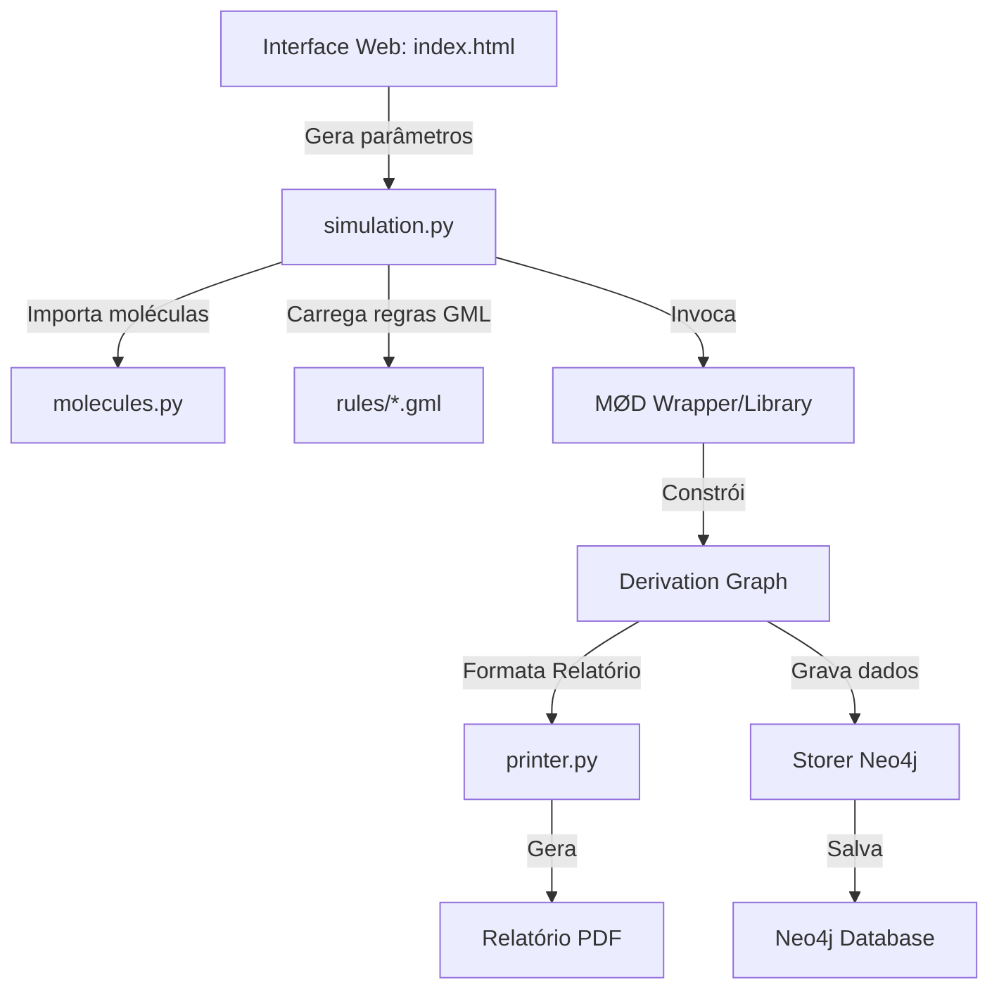

# 2PathTerpenes

*Disponível também em:* 🇺🇸 *[English](README.md)*

## Resumo do projeto
O **2PathTerpenes** é uma ferramenta de bioinformática e modelagem química baseada em gramática de grafos para reconstruir e explorar redes metabólicas de biossíntese de terpenos vegetais (monoterpenos C10 e sesquiterpenos C15). O projeto utiliza o simulador **MedØlDatschgerl (MØD)** e o formalismo de Double Pushout (DPO) para gerar caminhos de síntese de moléculas complexas (como $\beta$-caryophyllene, $\alpha$-humulene e $\beta$-farnesene) a partir de precursores acíclicos lineares como o Farnesyl Diphosphate (FPP). Os resultados da simulação podem ser exportados em relatórios estruturais PDF ou integrados a um banco de dados de grafos **Neo4j** sob restrições ecológicas e biológicas ("Scenarios").

## Lista de funcionalidades
*   **Definição Topológica de Moléculas**: Modelagem de precursores químicos e carbocátions usando representações lineares SMILES e DFS em grafos.
*   **Gramática de Regras de Reação GML**: Aplicação de mecanismos de reação realistas (ciclizações, rearranjos Wagner-Meerwein, shifts de hidreto, eliminação e adição de água).
*   **Geração Automática de Redes Químicas**: Exploração combinatorial e busca de caminhos de reachability resolvidos por Programação Linear Inteira (ILP).
*   **Exportação e Plotagem Visual**: Geração de relatórios em formato PDF com o grafo de derivação química estrutural.
*   **Análise de Restrições de Ciclização**: Propostas de filtros termodinâmicos e geométricos tridimensionais (tensão de anel) nas rotas químicas.

---

# Arquitetura

## Componentes
O fluxo de simulação é dividido em componentes de especificação de grafos, aplicação de gramáticas DPO, geração do grafo de derivação e persistência em banco de dados.

### Diagrama de componentes


### Interface Web
A interface web (https://waldeyr.github.io/2PathTerpenes) fornece um painel responsivo para selecionar regras de reação e definir parâmetros de simulação.

### Tecnologias e suas versões

| Tecnologia | Versão | Função Principal |
|---|---|---|
| MedØlDatschgerl (MØD) | v0.8.0 ou v1.0.0+ | Kernel de transformação de grafos químicos (DPO) e solver ILP. |
| Python | v3.8+ | Scripts de automação da simulação (`molecules.py`, `simulation.py`, `printer.py`). |
| Open Babel | v3.0+ | Geração de conformações 3D e cálculo de energia dos carbocátions. |
| Docker | v19.x+ | Empacotamento de ambiente Linux completo para execução do MØD de forma agnóstica. |

---

## Funcionalidades

### Requisitos

| Funcionalidade | Campo de Formulário | Campo de Banco de Dados | Regras Aplicadas |
|---|---|---|---|
| **Definição de Moléculas** | N/A (Arquivo de script) | `Compound.smiles`, `Compound.modName` | Sintaxe SMILES ou DFS para inicializar o multiset de reagentes da simulação. |
| **Geração de Rede Química** | N/A (Arquivo de script) | `Rule.modName`, `Compound.id` | Aplicação repetitiva de regras de DPO graph rewriting (`addSubset >> repeat`). |
| **Geração de PDF** | N/A (Relatório final) | N/A | Renderização dos intermediários com hidrogênios colapsados e coloração (vermelho para anéis, azul para cargas). |
| **Gravação de Cenários** | N/A (Script de carga) | `Scenario.scenarioID`, `Scenario.ncbiAccession`, `Scenario.pubmedAccession` | Mapeamento relacional de moléculas e reações físicas com ensaios in vitro descritos na literatura. |

---

## Análise de Restrições de Ciclização nas Regras de Simulação
Durante a geração de caminhos de síntese de sesquiterpenos, reações de ciclização eletrofílica ocorrem com alta reatividade molecular. Como o MØD tradicional atua apenas a nível topológico de grafos discretos, ciclizações impossíveis de ocorrer no espaço 3D real por alta tensão conformacional poderiam ser simuladas.

Identificamos **quatro possíveis melhorias de arquitetura** para implementar restrições de ciclização nas simulações:
1.  **Filtro de Energia Conformacional (via Open Babel)**: Com o MØD v1.0.0+, o Open Babel calcula coordenadas 3D e estima a energia livre de cada carbocátion via campo de força MMFF94 (`Graph.energy`). Pode-se implementar uma validação em Python que descarte intermediários de ciclização cujo delta de energia conformacional em relação ao precursor seja excessivo (tensão do anel inviável).
2.  **Restrições no Contexto das Regras GML**: Adição de caminhos rígidos e topologia impeditiva no `context` do GML. Impede a regra de ser aplicada se a molécula já tiver sistemas de anéis adjacentes rígidos que impeçam fisicamente o dobramento da cadeia.
3.  **Heurísticas com Estratégia de Derivação Customizada (DGStrat em Python)**: Utilização de uma estratégia de derivação escrita em Python para interceptar a criação de ciclos e bloquear reações que gerem anéis tensionados incompatíveis (ex: anéis com pontes complexas de 3 ou 4 carbonos em locais inadequados).
4.  **Hyperflow e Programação Linear com Custos**: No MØD v1.0, o solver de Programação Linear Inteira (ILP) pode atribuir custos e capacidades baseados em restrições termodinâmicas no fluxo geral da rede, minimizando caminhos energeticamente desfavoráveis.

---

## Instalação e uso

### Organização dos Arquivos de Regras e Recursos
*   **Regras GML (`rules/`)**: Todas as regras de reação GML oficiais são mantidas e atualizadas diretamente no diretório `rules/`. O diretório temporário/legado `rules/novas/` foi removido para evitar duplicidade.
*   **Imagens de Recursos (`docs/img/`)**: Apenas imagens que são ativamente usadas ou dinamicamente referenciadas (como visualizações de regras) por `docs/index.html` são mantidas no controle de versão. Arquivos temporários ou redundantes de imagem são limpos antes do commit.

### Gerando Previews de Regras GML

Para gerar as imagens de visualização SVG das regras de reação química exibidas na interface web:

1. **Execute o gerador dentro do Docker** (isso compila as regras GML e gera arquivos `.pdf` em `out/`):
   ```bash
   docker run --rm --volume "$(pwd):/home/shared" --workdir /home/shared 2path-terpenes-mod:latest -f /home/shared/generate_rules_svg.py
   ```

2. **Converta os PDFs gerados em SVGs** (rodando o loop dentro do container MØD de uma só vez):
   ```bash
   docker run --rm --entrypoint /bin/bash --volume "$(pwd):/home/shared" --workdir /home/shared 2path-terpenes-mod:latest -c "for f in out/*_{L,K,R}.pdf; do mod_post --mode pdfToSvg \${f%.pdf} \${f%.pdf}; done"
   ```

3. **Copie as imagens geradas para a pasta de recursos**:
   ```bash
   python organize_svgs.py
   ```
   Este script auxiliar copia os componentes `_L.svg`, `_K.svg` e `_R.svg` de `out/` diretamente para `docs/img/` mantendo seus nomes originais.

### Rodando Simulações com Docker (Recomendado)

#### Como testar na sua máquina:

1. **Reconstrua a imagem Docker**:
   ```bash
   docker build -t 2path-terpenes-mod:latest .
   ```
   *(Nota: A imagem Docker instala o compilador LaTeX com suporte a fontes Latin Modern `texlive-lmodern`, corrigindo eventuais problemas de compilação do arquivo de resumo `summary.pdf`. Para suportar ambientes LaTeX mínimos ou a imagem legada, também incluímos um arquivo de fallback mock `lmodern.sty` no workspace, de modo que a compilação use automaticamente as fontes padrão do LaTeX caso o pacote `lmodern` esteja ausente.)*

2. **Execute a simulação principal do projeto**:
   ```bash
   docker run --rm --volume $(pwd):/home/shared/ --workdir /home/shared/ 2path-terpenes-mod:latest -f /home/shared/molecules.py -f /home/shared/simulation.py -f /home/shared/printer.py
   ```

#### Opção Alternativa: Usando a Imagem Legada (waldeyr/mod_v0.8.0)
Caso prefira usar a imagem antiga pronta no Docker Hub sem buildar localmente:
```bash
docker run --rm --volume $(pwd):/home/shared/ --workdir /home/shared/ waldeyr/mod_v0.8.0:v1.0 /home/mod-v0.8.0/bin/mod -f /home/shared/molecules.py -f /home/shared/simulation.py -f /home/shared/printer.py
```

Os arquivos de simulação contêm **helpers de compatibilidade dinâmica**, agora atualizados para usar a nova interface de construção do MØD (`DG.build().execute()`) em versões mais novas (1.0+) para resolver avisos de depreciação de `dgRuleComp` e `DG.calc()`, assim como os avisos de depreciação para `pushVertexColour` e `postSection` em `printer.py`, mantendo total compatibilidade retroativa com versões legadas (0.8.0).

### Visualizador Interativo de Hipergrafos (HTML/JS)

Além do relatório em LaTeX/PDF, o grafo de derivação pode ser exportado como um "mapa de metrô" interativo no navegador: moléculas são estações e reações (que podem ter vários educts/produtos) são as conexões entre linhas, coloridas por categoria de regra (Mono/Sesqui/Common).

1. **Exportar o hipergrafo como JSON** (executar junto com os scripts de simulação existentes):
   ```bash
   docker run --rm --volume $(pwd):/home/shared/ --workdir /home/shared/ 2path-terpenes-mod:latest -f /home/shared/molecules.py -f /home/shared/simulation.py -f /home/shared/export_hypergraph.py -f /home/shared/printer.py
   ```
   Isso grava `out/hypergraph.json` e uma representação gráfica para cada molécula.

2. **Copiar os dados e as representações para `docs/`**:
   ```bash
   python organize_hypergraph_assets.py
   ```
   Isso gera `docs/data/hypergraph.json` e `docs/img/molecules/*.svg`.

3. **Abrir `docs/hypergraph.html`** (ou acessar via GitHub Pages, pelo link "Interactive Hypergraph Viewer" no seletor de regras). Se `docs/data/hypergraph.json` ainda não existir, a página usa `docs/data/hypergraph.sample.json` como exemplo, permitindo testar o visualizador sem rodar o MØD.

O visualizador suporta pan/zoom, busca por nome de molécula, filtro por categoria de reação, e clique em uma molécula ou reação para ver detalhes (SMILES, carga, anéis, regra(s) aplicada(s)).
