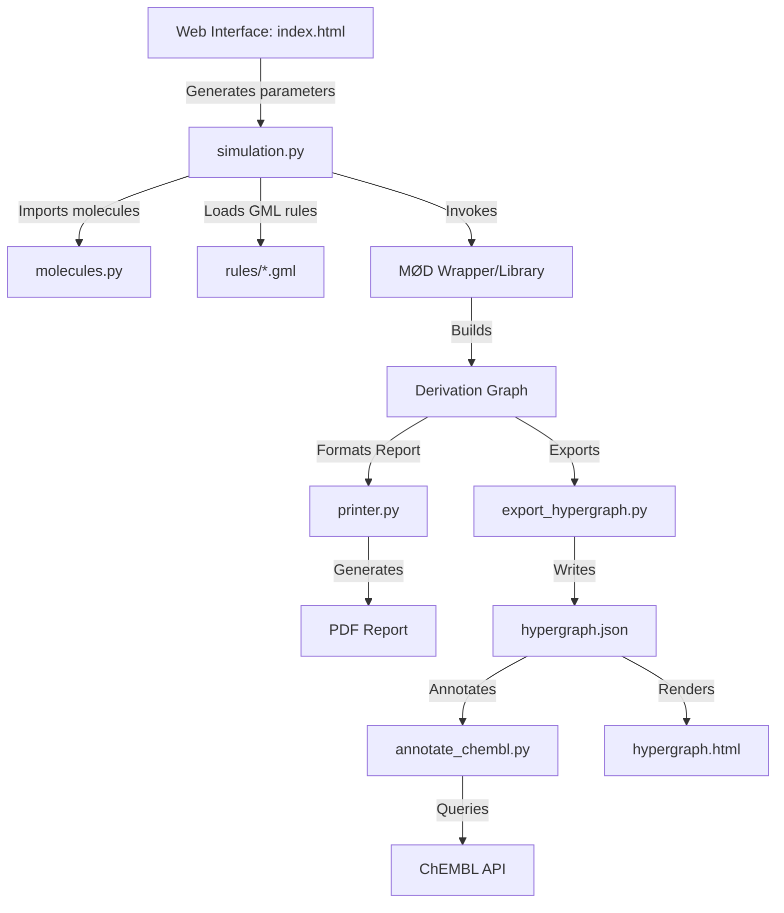

# 2PathTerpenes

*Also available in:* 🇧🇷 *[Português (Brasil)](README.PTBR.md)*

## Project Summary
**2PathTerpenes** is a bioinformatics and chemical modeling tool based on graph grammar to reconstruct and explore metabolic networks of plant terpene biosynthesis (C10 monoterpenes and C15 sesquiterpenes). The project utilizes the **MedØlDatschgerl (MØD)** simulator and the Double Pushout (DPO) formalism to generate synthesis pathways for complex molecules (such as $\beta$-caryophyllene, $\alpha$-humulene, and $\beta$-farnesene) starting from linear acyclic precursors like Farnesyl Diphosphate (FPP). The simulation results can be exported as structural PDF reports or as an interactive HTML/JavaScript hypergraph viewer, optionally annotated with compound identifiers from the ChEMBL database.

## Feature List
*   **Molecular Topological Definition**: Modeling of chemical precursors and carbocations using SMILES linear representations and DFS in graphs.
*   **GML Reaction Rule Grammar**: Application of realistic reaction mechanisms (cyclizations, Wagner-Meerwein rearrangements, hydride shifts, water addition and elimination).
*   **Automatic Chemical Network Generation**: Combinatorial exploration and search for reachability pathways solved by Integer Linear Programming (ILP).
*   **Visual Plotting and Export**: PDF report generation showing the structural chemical derivation graph.
*   **Cyclization Constraint Analysis**: Proposals for thermodynamic and 3D geometric filters (ring strain) on chemical routes.

---

# Architecture

## Components
The simulation workflow is divided into components for graph specification, DPO grammar application, derivation graph generation, and database persistence.

### Component Diagram


### Web Interface
The web interface (https://waldeyr.github.io/2PathTerpenes) provides a responsive dashboard for selecting reaction rules and defining simulation parameters.

### Technologies and their Versions

| Technology | Version | Main Function |
|---|---|---|
| MedØlDatschgerl (MØD) | v1.0.0+ | Chemical graph transformation kernel (DPO) and ILP solver. |
| Python | v3.8+ | Simulation automation scripts (`molecules.py`, `simulation.py`, `printer.py`). |
| Open Babel | v3.0+ | 3D conformation generation and energy calculation of carbocations. |
| Docker | v19.x+ | Full Linux environment packaging for agnostic execution of MØD. |

---

## Features

### Requirements

| Feature | Form Field | Database Field | Applied Rules |
|---|---|---|---|
| **Molecular Definition** | N/A (Script file) | `Compound.smiles`, `Compound.modName` | SMILES or DFS syntax to initialize the simulation reagents multiset. |
| **Chemical Network Generation** | N/A (Script file) | `Rule.modName`, `Compound.id` | Repetitive application of DPO graph rewriting rules (`addSubset >> repeat`). |
| **PDF Generation** | N/A (Final report) | N/A | Rendering of intermediates with collapsed hydrogens and coloring (red for rings, blue for charges). |
| **Scenario Saving** | N/A (Load script) | `Scenario.scenarioID`, `Scenario.ncbiAccession`, `Scenario.pubmedAccession` | Relational mapping of molecules and physical reactions with in vitro assays described in the literature. |

---

## Cyclization Constraint Analysis in Simulation Rules
During the generation of sesquiterpene synthesis pathways, electrophilic cyclization reactions occur with high molecular reactivity. Since traditional MØD operates only at the topological level of discrete graphs, cyclizations that are impossible to occur in actual 3D space due to high conformational strain could be simulated.

We have identified **four potential architectural improvements** to implement cyclization constraints in the simulations:
1. **Conformational Energy Filter (via Open Babel)**: With MØD v1.0.0+, Open Babel calculates 3D coordinates and estimates the free energy of each carbocation using the MMFF94 force field (`Graph.energy`). A validation script in Python can be implemented to discard cyclization intermediates where the conformational energy delta relative to the precursor is excessive (inviable ring strain).
2. **Constraints in the GML Rules Context**: Addition of rigid paths and preventing topology in the `context` of the GML rule. This prevents the rule from being applied if the molecule already contains rigid adjacent ring systems that physically prevent chain folding.
3. **Heuristics with Custom Derivation Strategy (DGStrat in Python)**: Use a derivation strategy written in Python to intercept cycle creation and block reactions that generate incompatible strained rings (e.g., complex bridged rings of 3 or 4 carbons in inappropriate positions).
4. **Hyperflow and Linear Programming with Costs**: In MØD v1.0, the Integer Linear Programming (ILP) solver can assign costs and capacities based on thermodynamic constraints in the overall network flow, minimizing energetically unfavorable pathways.

---

## Installation and Usage

### Organization of Rules and Resource Files
*   **GML Rules (`rules/`)**: All official GML reaction rules are maintained and updated directly in the `rules/` directory. The temporary/legacy `rules/novas/` directory has been removed to avoid duplication.
*   **Resource Images (`docs/img/`)**: Only images actively used or dynamically referenced (like rule previews) by `docs/index.html` are kept in version control. Temporary or redundant image files are cleaned up prior to committing.

### Generating GML Rule Previews

To generate the SVG preview images for the chemical reaction rules shown in the web interface:

1. **Run the generator inside Docker** (this compiles the GML rules and outputs `.pdf` files in `out/`):
   ```bash
   docker run --rm --volume "$(pwd):/home/shared" --workdir /home/shared 2path-terpenes-mod:latest -f /home/shared/generate_rules_svg.py
   ```

2. **Convert the generated PDFs to SVGs** (running the loop inside the MØD container in one go):
   ```bash
   docker run --rm --entrypoint /bin/bash --volume "$(pwd):/home/shared" --workdir /home/shared 2path-terpenes-mod:latest -c "for f in out/*_{L,K,R}.pdf; do mod_post --mode pdfToSvg \${f%.pdf} \${f%.pdf}; done"
   ```

3. **Copy generated SVGs to the assets folder**:
   ```bash
   python organize_svgs.py
   ```
   This helper script copies `_L.svg`, `_K.svg`, and `_R.svg` components from `out/` directly to `docs/img/` preserving their original names.

### Running Simulations with Docker (Recommended)

#### How to test on your machine:

1. **Rebuild the Docker image**:
   ```bash
   docker build -t 2path-terpenes-mod:latest .
   ```
   *(Note: The Docker image installs the LaTeX compiler with support for Latin Modern fonts `texlive-lmodern`, fixing potential compilation issues for the summary report `summary.pdf`. To support minimal LaTeX environments, we also include a fallback mock `lmodern.sty` in the workspace, so the compilation automatically falls back to default LaTeX fonts if `lmodern` is missing.)*

2. **Run the main project simulation**:
   ```bash
   docker run --rm --volume $(pwd):/home/shared/ --workdir /home/shared/ 2path-terpenes-mod:latest -f /home/shared/molecules.py -f /home/shared/simulation.py -f /home/shared/printer.py
   ```

### Interactive Hypergraph Viewer (HTML/JS)

In addition to the LaTeX/PDF report, the derivation graph can be exported as an interactive, browser-based "metro map" of the chemical hypergraph: molecules are stations and reactions (which may have several educts/products) are the connections between lines, color-coded by rule category (Mono/Sesqui/Common).

1. **Export the hypergraph as JSON** (run alongside the existing simulation scripts):
   ```bash
   docker run --rm --volume $(pwd):/home/shared/ --workdir /home/shared/ 2path-terpenes-mod:latest -f /home/shared/molecules.py -f /home/shared/simulation.py -f /home/shared/export_hypergraph.py -f /home/shared/printer.py
   ```
   This writes `out/hypergraph.json` and renders one PDF depiction per molecule.

2. **Convert the molecule depictions to SVG** (same `pdfToSvg` approach used for rule previews):
   ```bash
   docker run --rm --entrypoint /bin/bash --volume "$(pwd):/home/shared" --workdir /home/shared 2path-terpenes-mod:latest -c "for f in out/*_g_*.pdf; do mod_post --mode pdfToSvg \${f%.pdf} \${f%.pdf}; done"
   ```

3. **Copy the data and depictions into `docs/`**:
   ```bash
   python organize_hypergraph_assets.py
   ```
   This produces `docs/data/hypergraph.json` and `docs/img/molecules/*.svg`.

4. **(Optional) Annotate molecules with ChEMBL identifiers**:
   ```bash
   python annotate_chembl.py
   ```
   For each molecule with a `smiles` field, this computes its InChIKey (via the `obabel` CLI) and looks up an exact match in the [ChEMBL REST API](https://www.ebi.ac.uk/chembl/api/data/molecule), adding `chemblId`/`chemblName` fields to `docs/data/hypergraph.json` when a match is found. Results are cached in `docs/data/chembl_cache.json` so repeated runs only query ChEMBL for previously unseen structures. Matched molecules show their ChEMBL ID/name (with a link) in the viewer's details panel and become searchable by that name.

5. **Open `docs/hypergraph.html`** (or visit it on GitHub Pages, via the "Interactive Hypergraph Viewer" link in the rule selector). If `docs/data/hypergraph.json` is not present yet, the page falls back to `docs/data/hypergraph.sample.json` so the viewer can be previewed without running MØD.

The viewer supports pan/zoom, search by molecule name, filtering by reaction category, and clicking a molecule or reaction to see its details (SMILES, charge, rings, applied rule(s)).
